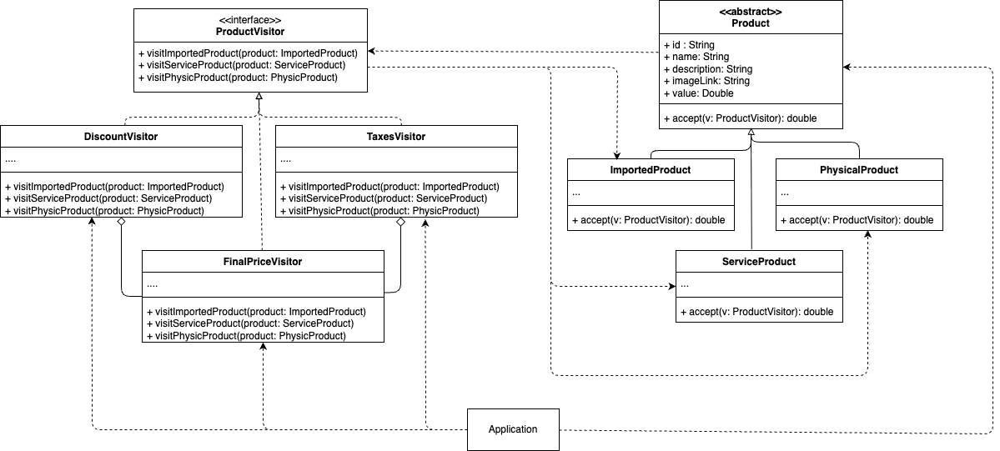

<h1 align="center">
  <br>
  <a href="http://www.amitmerchant.com/electron-markdownify"></a>
  <br>
  Pragma
  <br>
</h1>

<h4 align="center">Patrón de diseño Visitor, implementación y ejemplo en Flutter</h4>

<p align="center">
  <a href="https://docs.flutter.dev/">
    
  </a>
  <a href="https://dart.dev/"></a>
</p>
Este proyecto hace parte del artefacto asociado a los deseables en el uso del patrón de diseño Visitor, según el caso de uso. Debemos tener en cuenta un buen análisis para la implementación de este tipo de soluciones y evitar caer en la sobreingeniería. Para ejemplificar la implementación de este patrón, hemos optado por un escenario relacionado a un proceso con un carrito de compras. En este caso, el usuario podra seleccionar de manera ilimitada de una lista de productos de diferentes tipos(servicios, productos importados, productos normales) disponibles para luego dirigirse al carrito, donde podra editar la cantidad de productos y ver un resumen de su compra, zona donde se aprovecha las caracteristicas del patrón Visitor para calcular según el tipo de producto detalles como los impuestos y posibles descuentos.


<p></p>

A continuación se comparte el diagrama de clases del proyecto, enfocado en la implementación del patrón de diseño.
<p style="text-align: center;">
  
</p>


<p align="center">
  <a href="#topicos">Topicos</a> •
  <a href="#instalación-y-ejecución">Instalación y ejecución</a> •
  <a href="#estructura-del-proyecto">Estructura del proyecto</a> •
  <a href="#consideraciones">Consideraciones</a> •
  <a href="#tecnologias">Tecnologías</a> •
  <a href="#credits">Autores</a> •
  <a href="#related">Relacionados</a>
</p>

## Topicos

* Flutter
* Dart
* Visitor Pattern

## Instalación y ejecución

Para clonar y ejecutar está aplicación, necesitas [Git](https://git-scm.com) y [Flutter SDK](https://docs.flutter.dev/get-started/install) instalados en tu equipo. Una vez clonado el repositorio, es recomendable ejecutar el comando `flutter pub get`, comando el cual obtendra las dependencias del proyecto, una vez obtenidas las dependencias necesarias del proyecto mediante el anterior comando. Podemos  compilar el proyecto de ejemplo ya sea en el emulador, simulador o dispositivo físico.

## Estructura del proyecto

El proyecto está organizado siguiendo un enfoque **feature-first**, donde la estructura principal por funcionalidades. 

Se aplica **Clean Architecture**, estableciendo límites explícitos entre:

* Dominio: reglas de negocio puras e independientes.
* Aplicación: coordinación entre capas.
* Infraestructura: implementaciones concretas de dependencias externas.
* UI: presentación y gestión de estado.

Las dependencias siempre fluyen hacia el dominio, evitando acoplamientos a frameworks o detalles técnicos.

### Estructura de carpetas

```text
lib/
├── core/                       # Lógica compartida y utilidades base
│   ├── di/                     # Inyección de dependencias
│   ├── domain/
│   │   ├── models/             # Modelos base (Product, Service, Physical)
│   │   └── visitors/           # Interfaces del patrón Visitor (ProductVisitor)
│   └── presentation/           # Utilidades de UI compartidas
│       ├── enums/              # Enumeraciones globales
│       └── formatters/         # Formateadores (ej. CurrencyFormatter)
│
├── features/                   # Módulos funcionales de la aplicación
│   ├── cart/                   # Módulo del Carrito de Compras
│   │   ├── domain/
│   │   │   └── visitors/       # Lógica de negocio (Descuentos, Impuestos) via Visitor
│   │   └── presentation/
│   │       ├── provider/       # Gestión de estado (Cubit/Bloc)
│   │       ├── screens/        # Pantallas completas (CartScreen)
│   │       └── widgets/        # Componentes pequeños (CartCard)
│   │
│   └── products/               # Módulo de Productos
│       ├── data/               # Fuentes de datos (Fake Data, DTOs)
│       ├── domain/             # Contratos e interfaces
│       │   └── repository/     # Interfaz del repositorio
│       ├── infrastructure/     # Implementación de repositorios
│       └── presentation/       # UI del catálogo de productos
```

## Consideraciones

Para tomar una decisión informada sobre el uso del patrón de diseño Visitor, es esencial evaluar ciertos aspectos clave que garantizan un diseño eficiente, mantenible y escalable. A continuación, se presentan los principales puntos a considerar:

1. **Separación de algoritmos y estructura**
- Si quieres o requieres separar la lógica operativa (algoritmos) de los objetos sobre los que operan, manteniendo las clases de datos (tus modelos) limpias y ligeras.

2. **Extensibilidad y Escalabilidad**
- Especialmente útil cuando necesitas agregar nuevas operaciones frecuentemente sin modificar las clases de los elementos existentes.
- Nota: Es ideal cuando la jerarquía de clases de los objetos es estable y cambia poco, pero las operaciones sobre ellos crecen constantemente.

3. **Compatibilidad con Principios SOLID**
- Ejemplifica el Principio Abierto/Cerrado (OCP): permite introducir nuevos comportamientos (Visitors) sin modificar el código existente de los modelos.
- Favorece el Principio de Responsabilidad Única (SRP) al mover la lógica de negocio compleja fuera de las entidades de datos, agrupando toda la lógica relacionada en un solo lugar (el Visitor).

4. **Facilidad de Mantenimiento**
- Reduce la dispersión del código. En lugar de tener la lógica de "Cálculo de Impuestos" repartida en 10 clases de productos diferentes, la centralizas en una sola clase TaxVisitor.

5. **Impacto en el Rendimiento**
- Puede introducir complejidad estructural adicional debido al mecanismo de "Doble Despacho" (Double Dispatch), por lo que su uso debe justificarse cuando la variedad de operaciones supera la complejidad de implementarlo.


> [!TIP] 
>Utiliza el patrón Visitor cuando tengas una estructura de objetos con muchas clases distintas, y necesites realizar operaciones que dependen de sus clases concretas sin hacer validaciones adicionales.

> [!TIP] 
> Aplica el patrón cuando quieras limpiar tus modelos de dominio, evitando que se contaminen con lógica ajena a su responsabilidad principal (como formateo de UI, exportación a XML o lógica de descuentos complejos).

> [!TIP] Utiliza Visitor cuando preveas que las reglas de negocio (las operaciones) cambiarán o se expandirán con mucha más frecuencia que los tipos de datos (los modelos).


## Tecnologías
-   [Flutter](https://flutter.dev/)
-   [Dart](https://dart.dev/)


## Autores

| [<br><sub>Cristian Ramirez</sub>](https://github.com/juliocruizc) <br/> | 
:------------------------------------------------------------------------------------------------------------------------------------------------------------------------------:|


## Relacionados

- Los patrones de diseño son soluciones habituales a problemas que ocurren con frecuencia en el diseño de software. Son como planos que se pueden personalizar para resolver un problema de diseño particular de tu código. Para mayor información recomendamos visitar el siguiente [enlace](https://refactoring.guru/es/design-patterns).
